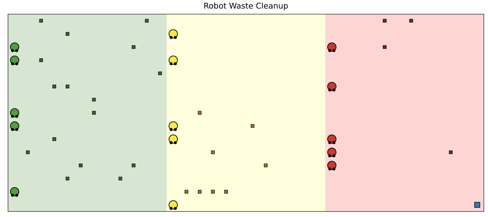

# Simulation Multi-Agents : Nettoyage de déchets radioactifs

Un groupe de robots doit nettoyer des déchets radioactifs répartis sur une grille divisée en trois zones de radioactivité croissante. Le projet explore comment les comportements individuels et la communication entre agents améliorent l'efficacité collective.  
Les différentes versions de notre algorithme sont détaillées dans la section "3) Évolution des versions et Analyse". Tous les résultats des simulations sont disponibles dans le dossier résults. Ils peuvent être obtenus par l'exécution de simulate.py. La comparaison de deux versions se fait à l'aide de compare.py. 


## 1) Contexte et objectif

Trois types de robots (vert, jaune, rouge) doivent nettoyer des déchets radioactifs dans un environnement en grille. Chaque type de robot est assigné à une zone et traite les déchets correspondants :

| Robot | Zone | Rôle |
|-------|------|------|
| **Vert** | z1 (faible radioactivité) | Collecte 2 déchets verts → fabrique 1 déchet jaune → le dépose à la frontière z1/z2 (en z1) |
| **Jaune** | z2 (radioactivité moyenne) | Collecte 2 déchets jaunes → fabrique 1 déchet rouge → le dépose à la frontière z2/z3 (en z2) |
| **Rouge** | z3 (forte radioactivité) | Collecte les déchets rouges → les dépose dans la zone de destruction (volontairement figée tout en bas à droite) |

La quantité initiale de déchets respecte le règle suivante : `4·n` verts, `2·n` jaunes, `1·n` rouge. La simulation s'arrête soit quand tous les déchets sont éliminés, soit après 5 000 pas (selon le paramètre dans simulate.py).


## 2) Environnement de simulation

**Grille** : hauteur × largeur, divisée en 3 zones verticales égales.

```
 z1 (vert)  |  z2 (jaune)  |  z3 (rouge)  | [D]
  robots      robots           robots       dépôt
  verts       jaunes           rouges
```


- `[D]` = zone de destruction en haut à droite `(width-1, 0)`
- Chaque robot a **2 emplacements** dans son inventaire

<p align="center">

</p>

Cette interface, issue de solara, permet de rendre compte la position des robots sur la map, ainsi que s'ils portent des déchets ou non grâce aux ronds en bas de chaque point représentant les robots (rond noir => slot vide / rond blanc => slot occupé par un déchet)

## 3) Évolution des versions et Analyse

Toutes les versions de l'algorithme sont testées sur plusieurs configurations faisant varier le nombre de robots, la quantité de déchets, la largeur et la hauteur de la grille.

### `v0_1` — Mouvement aléatoire (baseline)

Les robots se déplacent purement aléatoirement jusqu'à posséder un déchet trop radioactif (jaune pour robots verts, rouge pour robots jaunes et rouge pour robot rouge) ensuite, ils se dirigent vers les zônes de dépôt avant de reprendre un comportement aléatoire. Aucune logique de transfert entre robots. Sert de référence pour mesurer l'apport des versions suivantes.  
On observe que de nombreuses runs ne finissent pas, notamment à cause du fait que parfois, des robots portent des déchets mais ne peuvent pas les combiner car les seuls autres déchets sont portés par d'autres robots.

### `v0_2` — Transfert de déchets entre robots adjacents

Les robots du même type peuvent s'échanger des déchets lorsqu'ils sont sur des cellules voisines, permettant de former plus rapidement des paires pour créer le déchet de niveau supérieur, et éviter des lockdown en fin de run avec des robots de même couleur qui portent chacun 1 déchet et ne peuvent rien en faire puisqu'il n'est plus possible de ramasser un nouveau déchet sur la carte, déjà entièrement vidée.  
Le taux de nettoyage de la zone décolle grandement pour toutes les simulations avec plus d'un seul robot qui étaient auparavant coincées. 

### `v1_1` — Perception étendue (croix orthogonale)

Les robots perçoivent les déchets non seulement dans leur cellule mais aussi dans les 4 cellules orthogonales adjacentes (haut, bas, gauche, droite) à une distance de 2 pas en ligne droite. Ils se dirigent activement vers les déchets visibles.  
La vitesse de nettoyage est augmentée. 

### `v1_2` — Perception diagonale + orthogonale étendue

Extension de la perception aux 8 voisins immédiats (diagonales incluses) et aux cellules situées à 2 pas orthogonaux. Améliore la densité effective de collecte.  
La vitesse de nettoyage est très significativement augmentée, désormais, de nombreux settings initiaux conduisent à 100% de nettoyage en moins de 5000 étapes. 

### `v1_3` — Prévention de collisions + comportements améliorés

- Les robots ne peuvent plus occuper la même cellule
- Les robots portant des déchets ne foncent plus en ligne droite vers la zone de dépôt (comportement plus réaliste)
- La zone de dépôt est libérée après chaque dépôt, évitant les embouteillages  
La presque entièreté des simulations est nettoyée à 100%. Désormais, on va aussi s'intéresser à d'autres métriques pour notre analyse comme le nombre minimal de step pour un nettoyage complet. 

### `v1_4` — Transfert actif vers robots proches

Un robot portant un déchet cherche activement un autre robot du même type avec un emplacement libre dans son champ de vision, et se dirige vers lui pour accélérer la combinaison des paires.  
L'amélioration des performances est légère. On l'observe sur les graphes de la fraction de déchets traités en fonction du temps.  

### `v2_1` — Mémoire individuelle (`map_knowledge`)

Chaque robot maintient une carte mentale des déchets de sa couleur observés précédemment. Lorsqu'aucun déchet n'est visible, le robot se dirige vers la position mémorisée la plus proche. La mémoire est mise à jour à chaque pas de visualisation.  
L'amélioration est surtout notable dans des settings compliqué comme le setting 'very high waste' ou 'very tall' où les versions précédentes peinaient à aller chercher certains déchets dans des endroits reculés.

### `v2_2` — Communication inter-agents

Les robots du même type partagent leur `map_knowledge` avec les robots voisins (portée = 1 cellule + 2 pas orthogonaux). Communication par messages `INFORM_REF` contenant les positions de déchets connues. Cela permet à un robot d'apprendre l'existence de déchets qu'il n'a jamais vus directement.  
La communication améliore encore légèrement les résultats.

### `v3_1` — Cible aléatoire après dépôt ou combinaison

En analysant la heatmap des cellules les plus fréquentées, on se rend compte que le biais de déplacement introduit par la nécessité pour les robots de se rendre dans les zones de dépôts cause une répartition inégale de la fréquentation des cases. Notamment les cases en haut de la zone rouge sont très peu fréquentées. Notre solution est la suivante :  
Après avoir déposé un déchet à la frontière ou éliminé une paire, un robot se retrouvant les mains vides choisit immédiatement une cellule cible aléatoire dans sa propre zone (en excluant le bord est pour les robots verts/jaunes et la zone de destruction pour les robots rouges). Il s'y dirige avant de reprendre un comportement normal. Cela évite que les robots restent agglutinés près des zones de dépôt et améliore la dispersion spontanée après chaque livraison.

L'amélioration est nette sur les grilles larges et très hautes, où les robots avaient tendance à stagner près des frontières après un dépôt. Sur les configurations les plus difficiles (grille très haute h=36 : −21 %, grille très large w=30 : −13 %).

Moyenne globale : **322 pas** (−13 % par rapport à v2_2).

### `v4_1` — Mode recherche de partenaire (partner search)

En observant les simulations qui prennent le plus d'étapes à être complétées, nous nous sommes rendus compte que parfois, deux robots possèdent chacun un déchet et prennent un temps très long à se rencontrer en fin de simulation. Nous souhaitons améliorer ce comportement. 
Ajoute un compteur `idle_with_waste_steps` qui compte le nombre de pas consécutifs pendant lesquels un robot porte des déchets sans progresser (pas de déchet ramassé, pas de combinaison, pas de transfert). Lorsque ce compteur atteint la fenêtre [100, 200), le robot bascule dans un mode de déplacement préférentiel vers l'est (jamais vers l'ouest), pour tenter de se rapprocher d'un partenaire ou de la zone frontière. Le compteur se réinitialise dès qu'une action productive est accomplie.  
On referme la fenêtre à 200 pour éviter le cas où dans la configuration 1 robot/couleur, le robot n'a pas encore trouvé le dernier déchet et erre pendant plus de 100 pas (on l'empêche de chercher un partenaire indéfiniment sur la frontière).  

Ce mécanisme cible surtout les cas où un robot porte 1 déchet et erre sans trouver de congénère : en poussant vers la frontière est de sa zone, il augmente sa probabilité de croiser d'autres robots. L'effet est particulièrement visible sur les configurations "1 robot/color" (−2 %) et "very tall" (−21 %).

Moyenne globale : **300 pas** (−7 % par rapport à v3_1, −19 % par rapport à v2_2).

### `v5_1` — Déplacements aléatoires pondérés par la fréquence de visite (version actuelle)

Remplace tous les `random.choice(allowed_steps)` par une méthode `_weighted_random_step` : le poids attribué à chaque cellule candidate est inversement proportionnel au nombre de passages enregistrés dans `model.visit_counts` (compteur global, incrémenté par tous les robots). Les cellules peu visitées sont donc préférées, ce qui réduit le sur-clustering dans les zones déjà bien explorées et accélère la couverture des zones périphériques.  
L'idée vient des algorithmes de fourmi, ici on a implémenté un comportement opposé où une forte trace de phéromones va influencer négativement le choix d'une case par rapport à une autre. Cela favorise l'exploration globale de la carte.

L'amélioration est la plus marquée pour les configurations sous-peuplées ou géographiquement étendues, où l'errance aléatoire uniforme génère le plus de répétitions inutiles :

| Configuration | v4_1 | v5_1 | Gain |
|--------------|------|------|------|
| 1 robot/color | 980 | 637 | −35 % |
| Very tall (h=36) | 987 | 781 | −21 % |
| Very wide (w=30) | 396 | 335 | −15 % |
| 10 robots/color | 137 | 119 | −13 % |

Moyenne globale : **242 pas** (−19 % par rapport à v4_1, −35 % par rapport à v2_2).

L'amélioration apportée par cette version est significative.  

**Logique décisionnelle (v5_1)** à chaque pas :
1. Visualisation → mise à jour de `map_knowledge`
2. Communication → envoi/réception de `map_knowledge` aux voisins du même type
3. Action (par ordre de priorité) :
   - Si à la zone de dépôt avec des déchets → éliminer, puis choisir une cellule cible aléatoire dans la zone
   - Si les 2 emplacements sont pleins du même type → combiner
   - Si un robot adjacent porte le même type de déchet → recevoir (transfert)
   - Si un déchet du bon type est dans la cellule courante → ramasser
   - Si un robot étendu a besoin d'un transfert → s'en approcher
   - Si un déchet est visible autour → s'y diriger
   - Si `map_knowledge` non vide → se diriger vers le déchet mémorisé le plus proche
   - Si bord est de zone atteint sans déchet → reculer à l'ouest
   - Si une cellule cible (`target_cell`) est définie → s'y diriger
   - Sinon → si `idle_with_waste_steps` ∈ [100, 200) → mode partenaire (déplacement préférentiel est) ; sinon → déplacement aléatoire pondéré par l'inverse des fréquences de visite

  

Nous sommes très satisfaits par les derniers résultats produits par nos simulations. L'amélioration des performances par rapport à la baseline est très importante.

### Comparaison globale entre versions

Chaque version est évaluée sur les mêmes 300 simulations (15 configurations × 20 runs).

| Version | % nettoyées | Moy. pas | Min. pas | Max. pas | Gain (moy.) vs v0_1 |
|---------|-------------|----------|----------|----------|---------------------|
| `v0_1` | 7 % | 2 453 | 147 | 4 166 | — |
| `v0_2` | 77 % | 988 | 107 | 4 754 | −60 % |
| `v1_1` | 69 % | 628 | 72 | 4 143 | −74 % |
| `v1_2` | 96 % | 433 | 37 | 2 748 | −82 % |
| `v1_3` | **100 %** | 410 | 43 | 3 083 | −83 % |
| `v1_4` | **100 %** | 407 | 42 | 3 083 | −83 % |
| `v2_1` | **100 %** | 370 | 38 | 3 146 | −85 % |
| `v2_2` | **100 %** | 372 | 42 | 3 947 | −85 % |
| `v3_1` | **100 %** | 322 | 42 | 3 397 | −87 % |
| `v4_1` | **100 %** | 300 | 42 | 4 015 | −88 % |
| `v5_1` | **100 %** | **242** | **39** | **2 120** | **−90 %** |

Quelques jalons clés :
- **v0_2** : le simple transfert entre voisins fait passer le taux de complétion de 7 % à 77 %
- **v1_3** : premier palier à 100 % de complétion, grâce à la prévention de collisions
- **v2_1/v2_2** : la mémoire et la communication réduisent la moyenne sous 375 pas, sans gain supplémentaire entre elles
- **v3_1→v5_1** : la série de trois améliorations comportementales réduit la moyenne de 372 à 242 pas (−35 %) tout en maintenant 100 % de complétion et en ramenant le pire cas de 3 947 à 2 120 pas (−46 %)


## 4) Structure du projet

```
SMA/
├── 15_robot_mission_MAS2026/        # Code de simulation principal
│   ├── agents.py                    # Logique de chaque type de robot
│   ├── model.py                     # Modèle Mesa (grille, initialisation)
│   ├── objects.py                   # Déchets, radioactivité, zone de dépôt
│   ├── run.py                       # Lancement de la visualisation interactive
│   ├── server.py                    # Interface web Solara
│   └── communication/               # Système de messagerie inter-agents
│       ├── agent/CommunicatingAgent.py
│       ├── mailbox/Mailbox.py
│       └── message/
│           ├── Message.py
│           ├── MessagePerformative.py
│           └── MessageService.py
├── simulate.py                      # Runner de simulations en batch + génération des résultats
├── requirements.txt
└── results/                         # Résultats générés automatiquement
    ├── v0_1_<timestamp>/
    ├── v0_2_<timestamp>/
    ├── v1_1_<timestamp>/
    ├── v1_2_<timestamp>/
    ├── v2_2_<timestamp>/
    ├── v3_1_<timestamp>/
    ├── v4_1_<timestamp>/
    └── v5_1_<timestamp>/
```


## 5) Installation

```bash
# Cloner / naviguer dans le projet
cd SMA

# Créer un environnement virtuel (recommandé)
python -m venv .venv
source .venv/bin/activate   # macOS/Linux
# .venv\Scripts\activate    # Windows

# Installer les dépendances
pip install -r requirements.txt
```

**Dépendances principales** :
- `mesa==3.3.0` — framework multi-agents
- `matplotlib`, `seaborn` — visualisation des résultats
- `solara` — interface web interactive
- `numpy`, `networkx`, `altair`


## 6) Exécution

### Simulations en batch (génération des résultats)

```bash
python simulate.py
```

Lance **20 simulations indépendantes** pour chacune des 15 configurations paramétriques (graines aléatoires différentes). Les résultats sont sauvegardés dans `results/v2_2_<timestamp>/`.

Les configurations testées font varier :
- Le nombre de robots par couleur : 1, 3, 10, 14
- La largeur de la grille : 9, 15, 21, 30 (hauteur fixée à 15)
- La hauteur de la grille : 6, 15, 24, 36 (largeur fixée à 15)
- La densité de déchets (`n_waste`) : 1, 2, 4, 10

Pour changer la version simulée, modifier la variable `VERSION` en haut de `simulate.py`.

### Visualisation interactive

```bash
python 15_robot_mission_MAS2026/run.py
```

Ouvre un serveur Solara (généralement sur `http://localhost:8765`). Permet d'observer pas à pas le comportement des robots sur la grille, de régler les paramètres et de lancer/mettre en pause la simulation.


## 7) Résultats

### Dossiers de résultats

Chaque exécution de `simulate.py` crée un dossier `results/<version>_<timestamp>/` contenant :

```
results/v2_2_20260417_134519/
├── summary.csv
├── runs.csv
└── plots/
    ├── fraction_disposed_over_time.png
    ├── cleanup_rate_comparison.png
    └── visit_heatmaps.png
```

### `summary.csv` — Vue d'ensemble par simulation

Une ligne par simulation individuelle :

| Colonne | Description |
|---------|-------------|
| `config` | Nom de la configuration (ex : `n_robots=3`) |
| `run` | Numéro de la simulation (0 à 19) |
| `cleaned` | `True` si tous les déchets ont été éliminés avant la limite |
| `steps_to_clean` | Nombre de pas pour tout nettoyer (`NaN` si non terminé) |
| `n_green/yellow/red` | Nombre de robots par couleur |
| `n_waste` | Paramètre de densité de déchets |
| `height`, `width` | Dimensions de la grille |

### `runs.csv` — Séries temporelles détaillées

Une ligne par pas de simulation :

| Colonne | Description |
|---------|-------------|
| `step` | Numéro du pas |
| `fraction_disposed` | Fraction des déchets éliminés (0 → 1) |
| `waste_disposed` | Nombre cumulé de déchets éliminés |
| `waste_on_grid` | Déchets encore présents sur la grille |
| `waste_held` | Déchets portés par les robots |
| `throughput` | Déchets éliminés au cours de ce pas |
| `avg_utilization` | Fraction des robots ayant effectué une action utile |
| `config`, `run` | Identifiants de la simulation |

### Graphiques générés

**`fraction_disposed_over_time.png`**
Grille de sous-graphiques (un par configuration). Chaque graphique montre la fraction de déchets éliminés au fil du temps, avec la moyenne en trait plein et ±1 écart-type en zone ombrée. Permet de comparer la vitesse de convergence entre configurations.

**`cleanup_rate_comparison.png`**
Graphiques en barres comparant, pour chaque groupe de configurations :
- Le nombre moyen de pas pour nettoyer complètement
- Le nombre minimum de pas (meilleure simulation)
Les barres grises indiquent les configurations où certaines simulations n'ont pas terminé avant la limite de 5 000 pas.

**`visit_heatmaps.png`**
Carte de chaleur de la fréquence de visite moyenne de chaque cellule de la grille, agrégée sur les 20 runs. Révèle les zones sur-explorées ou sous-explorées et les goulots d'étranglement de circulation.

### Comment interpréter les résultats

- Un `fraction_disposed_over_time` qui atteint 1.0 rapidement → bonne coordination
- Un `avg_utilization` élevé → les robots sont actifs (peu d'errance)
- Des `visit_heatmaps` uniformes → exploration équilibrée de la grille
- Comparer les versions entre elles en chargeant les `summary.csv` de chaque dossier de résultats

```python
import pandas as pd
import glob

# Charger tous les résumés disponibles
dfs = []
for path in glob.glob("results/*/summary.csv"):
    df = pd.read_csv(path)
    df["version"] = path.split("/")[1].split("_")[0] + "_" + path.split("/")[1].split("_")[1]
    dfs.append(df)

summary = pd.concat(dfs)
print(summary.groupby(["version", "config"])["steps_to_clean"].mean())
```
